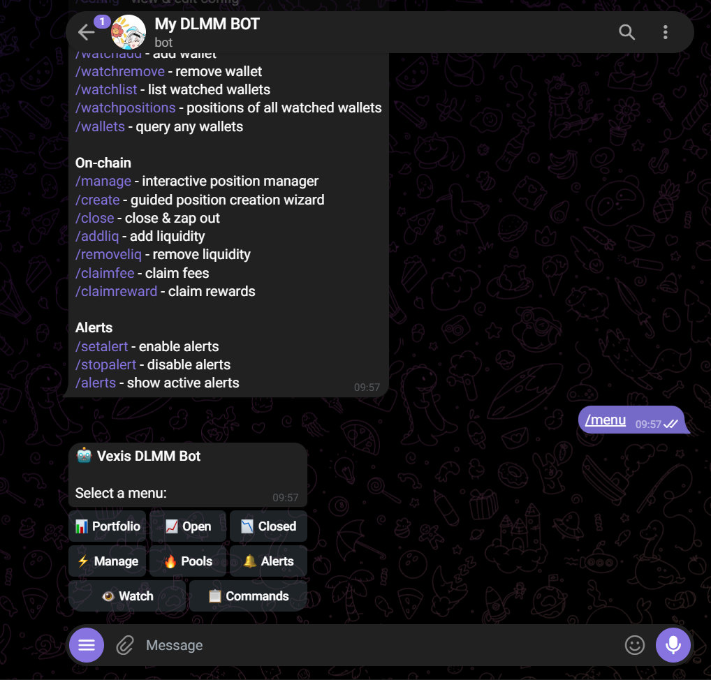
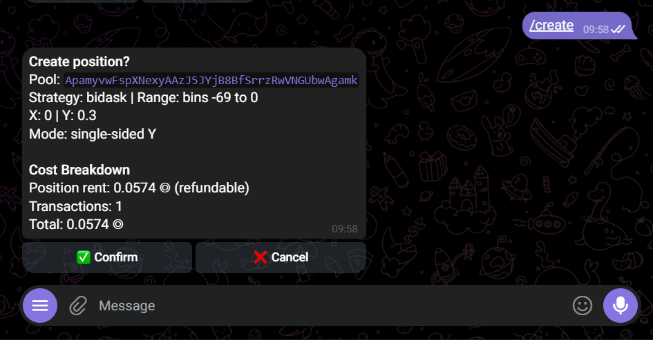
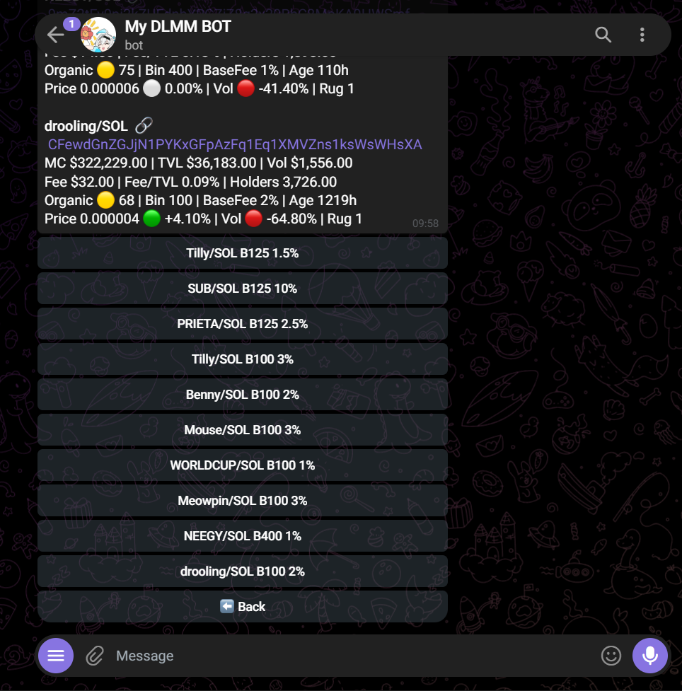
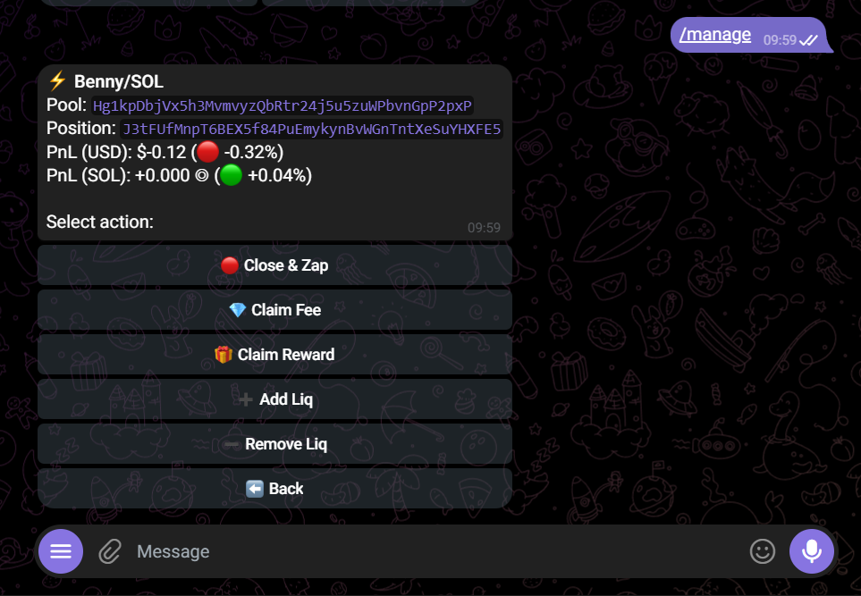
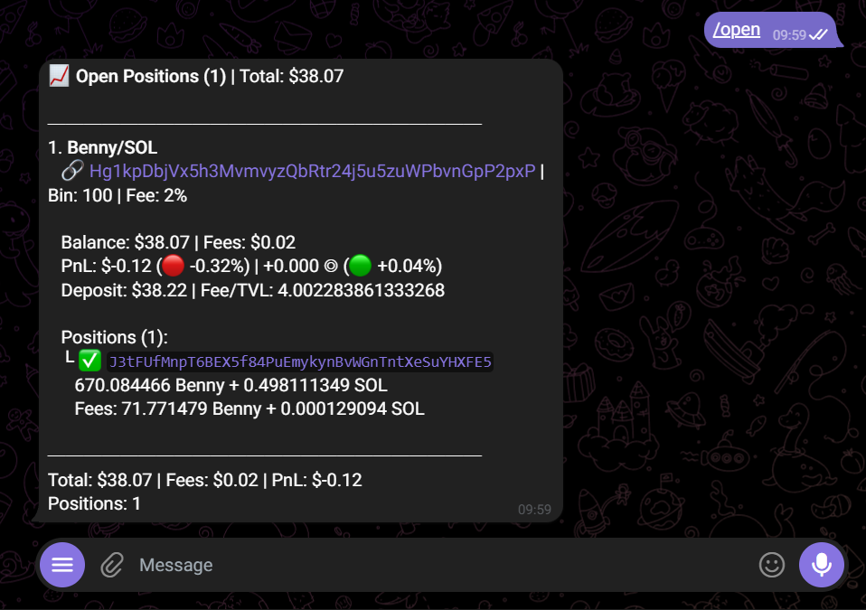
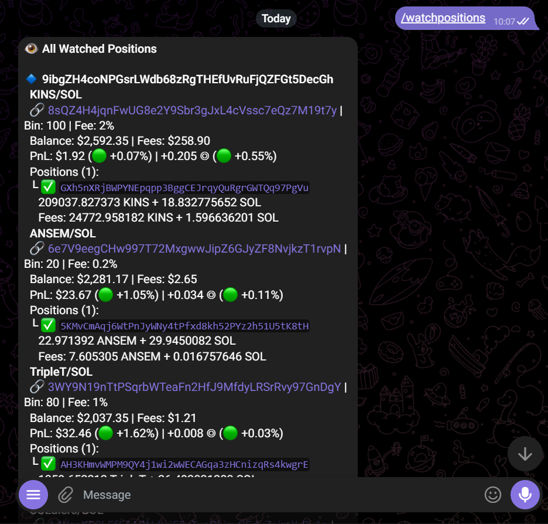

# My DLMM Bot

A Telegram bot and CLI tool for managing liquidity positions on [Meteora DLMM](https://app.meteora.ag/dlmm) — Solana's dynamic liquidity market maker.

Vexis discovers and screens pools using the Meteora Pool Discovery API, tracks portfolio PnL across wallets, and executes on-chain operations (create/close positions, add/remove liquidity, claim fees) directly from Telegram. All screening filters are configurable via config file or the `/config` command — no client-side rejection, all filtering happens at the API level.

Built with TypeScript, [Effect](https://effect.website/) (functional effect system + dependency injection), [grammY](https://grammy.dev/) (Telegram), and [@effect/cli](https://effect.website/docs/cli/) (CLI).

## Screenshots

| | | |
|:---:|:---:|:---:|
|  |  |  |
|  |  |  |

## Features

- **Pool Screening** — Full control over 30+ Discovery API filters (market cap, TVL, volume, fee, bin step, organic score, holders, volatility, pool price, swap count, traders, price trend, SOL pair only). Set `null` to skip any filter.
- **Portfolio Tracking** — View open and closed positions with PnL in both USD and SOL, fee earnings, and out-of-range detection.
- **On-chain Operations** — Create positions (guided wizard with strategy/range/amount selection), add/remove liquidity, close & zap out, claim fees and rewards — all from Telegram with inline confirmation.
- **Smart Alerts** — Cron-based detection for PnL changes, new/closed positions, balance changes, fee changes, and out-of-range events.
- **Take-Profit / Stop-Loss** — Automated rules that trigger on PnL thresholds per position.
- **Watchlist** — Track LP positions across multiple wallets in one place.
- **Config Editor** — Edit any config value interactively from Telegram via `/config`.

## Architecture

```
CLI (@effect/cli)          Telegram Bot (grammY)
        │                          │
        └──────────┬───────────────┘
                   ▼
        Handlers (portfolio, pool, create, manage, onchain, watchlist, ...)
                   ▼
        Effect Services (dependency-injected via Layers)
        ├── MeteoraApi   — positions, PnL, pool data
        ├── Screening    — Pool Discovery API filters
        ├── Dlmm         — DLMM SDK pool interactions
        ├── Zap          — token swaps (Meteora Zap SDK)
        ├── Solana       — RPC client, balances, tx signing
        ├── TokenMeta    — token metadata (Jupiter)
        └── Watchlist    — multi-wallet persistence
                   ▼
        External APIs: Meteora DLMM API · Pool Discovery API · Solana RPC · Jupiter
```

Domain types are validated at runtime with `Effect.Schema` — API responses are decoded, not trusted.

**Project layout:**

```
src/
├── cli.ts               # CLI entry point
├── telegram/
│   ├── bot.ts           # Bot entry point
│   ├── alerts.ts        # Cron-based alert engine
│   ├── tpsl.ts          # Take-profit / stop-loss engine
│   └── handlers/        # One handler per command group
├── services/            # Effect services (MeteoraApi, Dlmm, Screening, ...)
├── domain/              # Effect.Schema types (config, portfolio, pool, position)
├── lib/                 # Pure utilities (math, screening logic)
└── layers.ts            # Dependency injection wiring
```

Runtime state is persisted to git-ignored JSON files: `.vexis-alerts.json`, `.vexis-tpsl.json`, `.vexis-watchlist.json`.

## Install

Requires Node.js 20+.

```bash
npm install
npm run build
```

Copy and edit the config file:

```bash
cp vexis.config.example.json vexis.config.json
```

## Config

At minimum, set `wallet` for CLI usage, or `telegramBotToken` + `telegramChatId` for the bot. `privateKey` is only required for on-chain operations (create, add/remove liquidity, claim).

Config search order: `$VEXIS_CONFIG` (explicit path) → `./vexis.config.json` → `~/.vexis/config.json`

```json
{
  "wallet": "YourSolanaWalletAddress",
  "privateKey": "base64-or-base58-encoded-private-key",
  "rpcUrl": "https://api.mainnet-beta.solana.com",
  "telegramBotToken": "123456:ABC-your-bot-token-from-BotFather",
  "telegramChatId": "your-numeric-chat-id",
  "alertInterval": 0,
  "stopLossPct": -10,
  "takeProfitPct": 25,
  "create": {
    "strategy": "bidask",
    "mode": "single-y",
    "range": { "type": "default" },
    "amountPresets": [0.1, 0.25, 0.5, 1],
    "autoSwap": true,
    "slippageBps": 100
  },
  "pools": {
    "timeframe": "30m",
    "category": "top",
    "pageSize": 50,
    "displayLimit": 15,
    "minMcap": 250000,
    "minVolume": 1000,
    "minTvl": 5000,
    "maxTvl": 200000,
    "minFee": 50,
    "minBinStep": 20,
    "minOrganic": 60,
    "minQuoteOrganic": 60,
    "solPairOnly": true
  }
}
```

| Key | Description |
|---|---|
| `wallet` | Default wallet address for portfolio queries |
| `privateKey` | Base64/base58 keypair — loaded at startup only, never persisted |
| `rpcUrl` | Solana RPC endpoint |
| `alertInterval` | Alert check interval in minutes (`0` = disabled) |
| `stopLossPct` / `takeProfitPct` | Default TP/SL thresholds (%) |
| `create.strategy` | Liquidity distribution: `spot`, `curve`, `bidask` |
| `create.mode` | `single-y`, `single-x`, or `both` sided position |
| `create.slippageBps` | Swap slippage in basis points |
| `pools.*` | Pool screening filters (see below) |

### Screening Filters

Set any filter to `null` to skip it.

| Filter | Config Key | Description |
|---|---|---|
| Base token warnings | `baseTokenHasHighSupplyConcentration` | Boolean — exclude high supply concentration |
| Base token ownership | `baseTokenHasHighSingleOwnership` | Boolean — exclude high single ownership |
| Market cap | `minMcap` / `maxMcap` | Min/max base token market cap |
| Holders | `minHolders` / `maxHolders` | Min/max base token holders |
| Organic score | `minOrganic` / `maxOrganic` | Min/max base token organic score |
| Quote organic | `minQuoteOrganic` / `maxQuoteOrganic` | Min/max quote token organic score |
| Token age | `minTokenAgeHours` / `maxTokenAgeHours` | Min/max age in hours |
| Launchpad block | `blockedLaunchpads` | Array of blocked launchpad names |
| TVL | `minTvl` / `maxTvl` | Min/max total value locked |
| Active TVL | `minActiveTvl` / `maxActiveTvl` | Min/max active TVL |
| Volume | `minVolume` / `maxVolume` | Min/max trading volume |
| Fee | `minFee` / `maxFee` | Min/max fee amount ($) |
| Fee/TVL ratio | `minFeeActiveTvlRatio` / `maxFeeActiveTvlRatio` | Min/max fee-to-TVL ratio |
| Bin step | `minBinStep` / `maxBinStep` | Min/max DLMM bin step |
| Volatility | `minVolatility` / `maxVolatility` | Min/max pool volatility |
| Pool price | `minPoolPrice` / `maxPoolPrice` | Min/max pool price |
| Active positions | `minActivePositions` / `maxActivePositions` | Min/max active positions |
| Open positions | `minOpenPositions` / `maxOpenPositions` | Min/max open positions |
| Swap count | `minSwapCount` / `maxSwapCount` | Min/max swap count |
| Unique traders | `minUniqueTraders` / `maxUniqueTraders` | Min/max unique traders |
| Price change % | `minPriceChangePct` / `maxPriceChangePct` | Min/max price change percentage |
| Volume change % | `minVolumeChangePct` / `maxVolumeChangePct` | Min/max volume change percentage |
| Price trend | `priceTrend` | Filter by price trend direction |
| SOL pair only | `solPairOnly` | Boolean — only show SOL-paired pools |

## Telegram Bot

### Setup

1. Open [@BotFather](https://t.me/BotFather) on Telegram, send `/newbot`, follow the prompts, and copy the bot token.
2. Open [@userinfobot](https://t.me/userinfobot) to get your numeric chat ID.
3. Add both to your config file:

```json
{
  "telegramBotToken": "123456:ABC-your-bot-token-from-BotFather",
  "telegramChatId": "your-numeric-chat-id"
}
```

4. Start the bot:

```bash
npm run bot
```

5. Open your bot on Telegram and send `/start` to verify it's working.

### Commands

**Read-only**

| Command | Description |
|---|---|
| `/balance` | SOL + token balances |
| `/portfolio` | Total PnL summary (USD + SOL) |
| `/open` | Open positions with PnL, fees, range status |
| `/closed` | Closed positions |
| `/pools` | Top pools matching your screening filters |
| `/pool <address>` | Pool detail |
| `/config` | View & edit config interactively |

**On-chain** (requires `privateKey`)

| Command | Description |
|---|---|
| `/create` | Guided wizard: pick pool → strategy → range → amount → confirm |
| `/manage` | Interactive position manager |
| `/close` | Close position & zap out to SOL |
| `/addliq` | Add liquidity to an existing position |
| `/removeliq` | Remove liquidity |
| `/claimfee` | Claim accumulated fees |
| `/claimreward` | Claim rewards |

**Watchlist**

| Command | Description |
|---|---|
| `/watchadd` | Add a wallet to the watchlist |
| `/watchremove` | Remove a wallet |
| `/watchlist` | List watched wallets |
| `/watchpositions` | Positions across all watched wallets |
| `/wallets <addr...>` | One-off query for arbitrary wallets |

**Automation**

| Command | Description |
|---|---|
| `/alerts` | Configure alert types & interval |
| `/tpsl` | Configure take-profit / stop-loss rules |

### Alerts & TP/SL

With `alertInterval > 0`, the bot polls on a cron schedule and notifies you on: PnL changes past thresholds, positions going out of range, new/closed positions, balance changes, and fee accrual. TP/SL rules evaluate per-position PnL% and fire once when the threshold is crossed. State survives restarts via `.vexis-alerts.json` and `.vexis-tpsl.json`.

## CLI

```bash
npm run dev -- <command>   # dev mode (tsx)
npm start -- <command>     # compiled (after npm run build)
```

```bash
vexis open [wallet]        # Open positions
vexis closed [wallet]      # Closed positions
vexis summary [wallet]     # Total PnL (USD + SOL)
vexis pool list            # Trending pools (screened)
vexis pool info <address>  # Pool detail
```

## Development

```bash
npm run dev          # Run CLI from source
npm run bot          # Run bot from source
npm run typecheck    # tsc --noEmit
npm test             # vitest run
npm run test:watch   # vitest watch mode
```

Tests cover the pure layers: math utilities, screening logic, API response decoding, formatting, and session storage (`test/`).

## Deploy

### VPS / Server (pm2)

```bash
npm install && npm run build
pm2 start "npm run bot" --name vexis-bot
pm2 save
pm2 startup
```

### Docker

```dockerfile
FROM node:20-slim
WORKDIR /app
COPY package*.json ./
RUN npm ci && npm run build
COPY . .
CMD ["npm", "run", "bot"]
```

```bash
docker build -t vexis-bot .
docker run -d --restart unless-stopped \
  -v $(pwd)/vexis.config.json:/app/vexis.config.json \
  --name vexis-bot \
  vexis-bot
```

### Railway / Render

Deploy directly from GitHub. Set these in your config file or via environment variables in the dashboard:

- `TELEGRAM_BOT_TOKEN`
- `TELEGRAM_CHAT_ID`
- `VEXIS_PRIVATE_KEY`
- `RPC_URL`

Build command: `npm install && npm run build`

Start command: `npm run bot`

## Security Notes

- `vexis.config.json` contains your private key and bot token.
- The keypair is decoded in memory at startup and never written to disk.
- Prefer a dedicated hot wallet with limited funds for bot operations.
