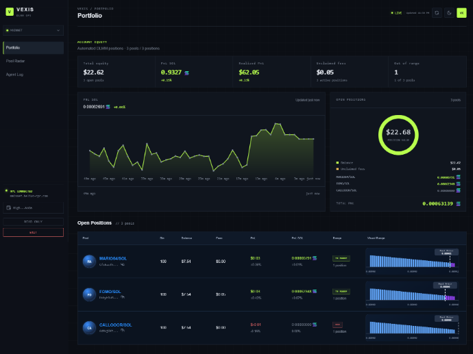
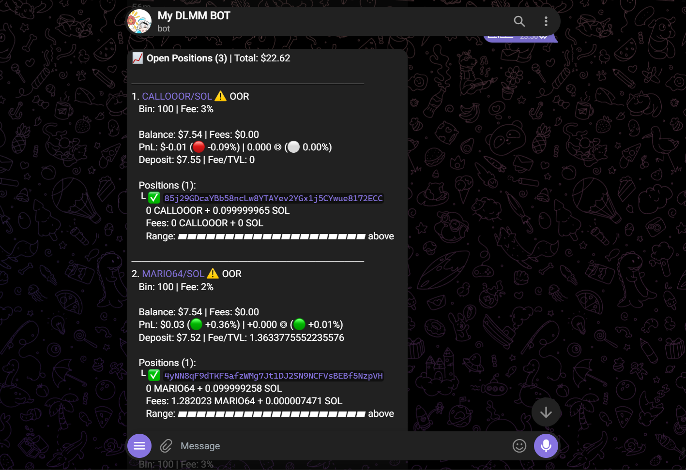

# My DLMM Bot

A Telegram bot and CLI tool for managing liquidity positions on [Meteora DLMM](https://app.meteora.ag/dlmm) — Solana's dynamic liquidity market maker.

Vexis discovers and screens pools using the Meteora Pool Discovery API, tracks portfolio PnL across wallets, and executes on-chain operations (create/close positions, add/remove liquidity, claim fees) directly from Telegram. All screening filters are configurable via config file or the `/config` command — no client-side rejection, all filtering happens at the API level.

Built with TypeScript, [Effect](https://effect.website/) (functional effect system + dependency injection), [grammY](https://grammy.dev/) (Telegram), and [@effect/cli](https://effect.website/docs/cli/) (CLI).

## Documentation

- **[AI Agent Guide (Indonesian)](docs/ai-agent.md)** — how the AI agent works, setup, commands, and monitoring.
- **[Configuration Reference (Indonesian)](docs/config-reference.md)** — every config key, default value, and environment variable.
- **[Troubleshooting (Indonesian)](docs/troubleshooting.md)** — symptom → cause → fix for common issues.
- **[Prompt for AI Coding Agents (Indonesian)](docs/coding-agent-prompt.md)** — copy-paste prompts for Claude Code, Codex, and other agentic coding tools.

## Zero-Setup via AI Coding Agent

Paste this into Claude Code, Codex, or any AI coding agent in an empty folder. The agent clones the repo, reads the docs, and performs the full installation (Node.js, dependencies, config, secrets). You only answer preference questions:

```text
Clone repo https://github.com/mgalihpp/my-dlmm-bot ke folder ini. Baca README.md di repo tersebut, lalu ikuti prompt setup di docs/coding-agent-prompt.md. Kerjakan seluruh instalasi dari nol (Node.js, dependencies, config, secret). Jawab dalam bahasa Indonesia.
```

If you are an AI coding agent reading this README: the one-shot setup prompt lives in [docs/coding-agent-prompt.md](docs/coding-agent-prompt.md).

## Screenshots

| | |
|:---:|:---:|
|  |  |

## Features

- **Pool Screening** — Full control over 30+ Discovery API filters (market cap, TVL, volume, fee, bin step, organic score, holders, volatility, pool price, swap count, traders, price trend, SOL pair only). Set `null` to skip any filter.
- **Portfolio Tracking** — View open and closed positions with PnL in both USD and SOL, fee earnings, and out-of-range detection.
- **On-chain Operations** — Create positions (guided wizard with strategy/range/amount selection), add/remove liquidity, close & zap out, claim fees and rewards — all from Telegram with inline confirmation.
- **Smart Alerts** — Cron-based detection for PnL changes, new/closed positions, balance changes, fee changes, and out-of-range events.
- **Take-Profit / Stop-Loss** — Automated rules that trigger on PnL thresholds per position.
- **Watchlist** — Track LP positions across multiple wallets in one place.
- **Config Editor** — Edit any config value interactively from Telegram via `/config`.
- **AI Agent** — Automated position management: an LLM decides `open`/`hold` per screened pool, deterministic guardrails block unsafe opens, plus TP/SL and out-of-range handling with Darwinian weight learning. See [AI Agent](#ai-agent).

## Architecture

```
CLI (@effect/cli)          Telegram Bot (grammY)
        │                          │
        └──────────┬───────────────┘
                   ▼
        Handlers (portfolio, pool, create, manage, onchain, watchlist, ...)
                   ▼
        Effect Services (dependency-injected via Layers)
        ├── MeteoraApi   — positions, PnL, pool data
        ├── Screening    — Pool Discovery API filters
        ├── Dlmm         — DLMM SDK pool interactions
        ├── Zap          — token swaps (Meteora Zap SDK)
        ├── Solana       — RPC client, balances, tx signing
        ├── TokenMeta    — token metadata (Jupiter)
        └── Watchlist    — multi-wallet persistence
                   ▼
        External APIs: Meteora DLMM API · Pool Discovery API · Solana RPC · Jupiter
```

Domain types are validated at runtime with `Effect.Schema` — API responses are decoded, not trusted.

**Project layout:**

```
src/
├── cli.ts               # CLI entry point
├── telegram/
│   ├── bot.ts           # Bot entry point
│   ├── alerts.ts        # Cron-based alert engine
│   ├── tpsl.ts          # Take-profit / stop-loss engine
│   ├── agent/           # AI agent (LLM decisions, guardrails, journal)
│   └── handlers/        # One handler per command group
├── services/            # Effect services (MeteoraApi, Dlmm, Screening, ...)
├── domain/              # Effect.Schema types (config, portfolio, pool, position)
├── lib/                 # Pure utilities (math, screening logic)
└── layers.ts            # Dependency injection wiring
```

Runtime state is persisted to git-ignored JSON files: `.vexis-alerts.json`, `.vexis-tpsl.json`, `.vexis-watchlist.json`.

## Install

Requires Node.js 20+.

```bash
npm install
npm run build
```

Copy and edit the config file:

```bash
cp vexis.config.example.json vexis.config.json
```

## Config

At minimum, set `wallet` for CLI usage, or `telegramBotToken` + `telegramChatId` for the bot. `privateKey` is only required for on-chain operations (create, add/remove liquidity, claim).

Config search order: `$VEXIS_CONFIG` (explicit path) → `./vexis.config.json` → `~/.vexis/config.json`

```json
{
  "wallet": "YourSolanaWalletAddress",
  "privateKey": "base64-or-base58-encoded-private-key",
  "rpcUrl": "https://api.mainnet-beta.solana.com",
  "telegramBotToken": "123456:ABC-your-bot-token-from-BotFather",
  "telegramChatId": "your-numeric-chat-id",
  "alertInterval": 0,
  "stopLossPct": -10,
  "takeProfitPct": 25,
  "create": {
    "strategy": "bidask",
    "mode": "single-y",
    "range": { "type": "default" },
    "amountPresets": [0.1, 0.25, 0.5, 1],
    "autoSwap": true,
    "slippageBps": 100
  },
  "pools": {
    "timeframe": "30m",
    "category": "top",
    "pageSize": 50,
    "displayLimit": 15,
    "minMcap": 250000,
    "minVolume": 1000,
    "minTvl": 5000,
    "maxTvl": 200000,
    "minFee": 50,
    "minBinStep": 20,
    "minOrganic": 60,
    "minQuoteOrganic": 60,
    "solPairOnly": true
  }
}
```

| Key | Description |
|---|---|
| `wallet` | Default wallet address for portfolio queries |
| `privateKey` | Base64/base58 keypair — loaded at startup only, never persisted |
| `rpcUrl` | Solana RPC endpoint |
| `alertInterval` | Alert check interval in minutes (`0` = disabled) |
| `stopLossPct` / `takeProfitPct` | Default TP/SL thresholds (%) |
| `create.strategy` | Liquidity distribution: `spot`, `curve`, `bidask` |
| `create.mode` | `single-y`, `single-x`, or `both` sided position |
| `create.slippageBps` | Swap slippage in basis points |
| `pools.*` | Pool screening filters (see below) |
| `agent.*` | AI agent config (see [AI Agent](#ai-agent)) |

### Screening Filters

Set any filter to `null` to skip it.

| Filter | Config Key | Description |
|---|---|---|
| Base token warnings | `baseTokenHasHighSupplyConcentration` | Boolean — exclude high supply concentration |
| Base token ownership | `baseTokenHasHighSingleOwnership` | Boolean — exclude high single ownership |
| Market cap | `minMcap` / `maxMcap` | Min/max base token market cap |
| Holders | `minHolders` / `maxHolders` | Min/max base token holders |
| Organic score | `minOrganic` / `maxOrganic` | Min/max base token organic score |
| Quote organic | `minQuoteOrganic` / `maxQuoteOrganic` | Min/max quote token organic score |
| Token age | `minTokenAgeHours` / `maxTokenAgeHours` | Min/max age in hours |
| Launchpad block | `blockedLaunchpads` | Array of blocked launchpad names |
| TVL | `minTvl` / `maxTvl` | Min/max total value locked |
| Active TVL | `minActiveTvl` / `maxActiveTvl` | Min/max active TVL |
| Volume | `minVolume` / `maxVolume` | Min/max trading volume |
| 24h Volume | `minVolume24h` / `maxVolume24h` | Min/max 24h trading volume (server-side, independent of screening timeframe) |
| Fee | `minFee` / `maxFee` | Min/max fee amount ($) |
| Fee/TVL ratio | `minFeeActiveTvlRatio` / `maxFeeActiveTvlRatio` | Min/max fee-to-TVL ratio |
| Bin step | `minBinStep` / `maxBinStep` | Min/max DLMM bin step |
| Volatility | `minVolatility` / `maxVolatility` | Min/max pool volatility |
| Pool price | `minPoolPrice` / `maxPoolPrice` | Min/max pool price |
| Active positions | `minActivePositions` / `maxActivePositions` | Min/max active positions |
| Open positions | `minOpenPositions` / `maxOpenPositions` | Min/max open positions |
| Swap count | `minSwapCount` / `maxSwapCount` | Min/max swap count |
| Unique traders | `minUniqueTraders` / `maxUniqueTraders` | Min/max unique traders |
| Price change % | `minPriceChangePct` / `maxPriceChangePct` | Min/max price change percentage |
| Volume change % | `minVolumeChangePct` / `maxVolumeChangePct` | Min/max volume change percentage |
| Price trend | `priceTrend` | Filter by price trend direction |
| SOL pair only | `solPairOnly` | Boolean — only show SOL-paired pools |

## AI Agent

Automated DLMM position management (`/agent`). The agent screens pools, lets an LLM decide `open`/`hold` per candidate, then opens positions behind deterministic guardrails — with TP/SL and out-of-range (OOR) handling on top. Full details: [docs/ai-agent.md](docs/ai-agent.md). The guide also links a [configuration reference](docs/config-reference.md), a [troubleshooting guide](docs/troubleshooting.md), and [copy-paste prompts for AI coding agents](docs/coding-agent-prompt.md) (Claude Code, Codex, etc.).

**How it works:**

```
Screening (deterministic) → LLM decides open/hold → validate (anti-hallucination) → guardrails (hard block) → createPosition
```

- **LLM decides** — the heuristic only ranks which pools the LLM sees (`minCandidate` no longer gates). If the LLM call fails, the whole cycle is skipped — zero trades.
- **Guardrails** — deterministic filters that the LLM can't bypass: duplicate/cooldown/risk/budget checks.
- **TP/SL** — automated take-profit / stop-loss on PnL thresholds.
- **OOR** — out-of-range positions get a separate LLM `hold`/`close` decision.
- **Darwinian weights** — signal weights re-learned from closed-position PnL.
- **Journal** — every cycle logged to `.vexis-agent-journal.jsonl` (JSONL).

```json
{
  "agent": {
    "enabled": false,
    "maxCandidates": 5,
    "maxSolPerPosition": 0.5,
    "maxTotalSol": 3,
    "maxOpenPositions": 4,
    "txCooldownMs": 300000,
    "poolCooldownMs": 86400000,
    "tpPct": 25,
    "slPct": -10,
    "llm": {
      "baseUrl": "https://api.openai.com/v1",
      "model": "gpt-4o-mini",
      "apiKey": "sk-...",
      "timeoutMs": 120000
    }
  }
}
```

Commands: `/agent start`, `/agent stop`, `/agent status`, `/agent portfolio`, `/agent journal [n]`. Agent state persists to `.vexis-agent.json`.

## Telegram Bot

### Setup

1. Open [@BotFather](https://t.me/BotFather) on Telegram, send `/newbot`, follow the prompts, and copy the bot token.
2. Open [@userinfobot](https://t.me/userinfobot) to get your numeric chat ID.
3. Add both to your config file:

```json
{
  "telegramBotToken": "123456:ABC-your-bot-token-from-BotFather",
  "telegramChatId": "your-numeric-chat-id"
}
```

4. Start the bot:

```bash
npm run bot
```

5. Open your bot on Telegram and send `/start` to verify it's working.

### Commands

**Read-only**

| Command | Description |
|---|---|
| `/balance` | SOL + token balances |
| `/portfolio` | Total PnL summary (USD + SOL) |
| `/open` | Open positions with PnL, fees, range status |
| `/closed` | Closed positions |
| `/pools` | Top pools matching your screening filters |
| `/pool <address>` | Pool detail |
| `/config` | View & edit config interactively |

**On-chain** (requires `privateKey`)

| Command | Description |
|---|---|
| `/create` | Guided wizard: pick pool → strategy → range → amount → confirm |
| `/manage` | Interactive position manager |
| `/close` | Close position & zap out to SOL |
| `/addliq` | Add liquidity to an existing position |
| `/removeliq` | Remove liquidity |
| `/claimfee` | Claim accumulated fees |
| `/claimreward` | Claim rewards |

**Watchlist**

| Command | Description |
|---|---|
| `/watchadd` | Add a wallet to the watchlist |
| `/watchremove` | Remove a wallet |
| `/watchlist` | List watched wallets |
| `/watchpositions` | Positions across all watched wallets |
| `/wallets <addr...>` | One-off query for arbitrary wallets |

**Automation**

| Command | Description |
|---|---|
| `/alerts` | Configure alert types & interval |
| `/tpsl` | Configure take-profit / stop-loss rules |

### Alerts & TP/SL

With `alertInterval > 0`, the bot polls on a cron schedule and notifies you on: PnL changes past thresholds, positions going out of range, new/closed positions, balance changes, and fee accrual. TP/SL rules evaluate per-position PnL% and fire once when the threshold is crossed. State survives restarts via `.vexis-alerts.json` and `.vexis-tpsl.json`.

## Web UI

Vexis includes a read-only neo-brutalist dashboard for portfolio monitoring, pool screening, and AI agent history. It runs as a separate process and never exposes on-chain controls or private keys.

Enable it in `vexis.config.json`:

```json
{
  "web": {
    "enabled": true,
    "port": 8080,
    "password": "your-dashboard-password"
  }
}
```

`VEXIS_WEB_PASSWORD` overrides the config password. The dashboard is disabled by default.

```bash
cd src/web-react
npm install && npm run build   # build (react-router)
npm run dev                    # dev mode
PORT=8080 npm run start        # compiled mode
```

The React dashboard refreshes through its own server loaders. For pm2:

```bash
cd src/web-react
npm install && npm run build
PORT=8080 pm2 start "npm run start" --name vexis-web
pm2 save
```

## CLI

```bash
npm run dev -- <command>   # dev mode (tsx)
npm start -- <command>     # compiled (after npm run build)
```

```bash
vexis open [wallet]        # Open positions
vexis closed [wallet]      # Closed positions
vexis summary [wallet]     # Total PnL (USD + SOL)
vexis pool list            # Trending pools (screened)
vexis pool info <address>  # Pool detail
```

## Development

```bash
npm run dev          # Run CLI from source
npm run bot          # Run bot from source
npm run typecheck    # tsc --noEmit
npm test             # vitest run
npm run test:watch   # vitest watch mode
```

Tests cover the pure layers: math utilities, screening logic, API response decoding, formatting, and session storage (`test/`).

## Deploy

### VPS / Server (pm2)

```bash
npm install && npm run build
pm2 start "npm run bot" --name vexis-bot
pm2 save
pm2 startup
```

### Docker

```dockerfile
FROM node:20-slim
WORKDIR /app
COPY package*.json ./
RUN npm ci && npm run build
COPY . .
CMD ["npm", "run", "bot"]
```

```bash
docker build -t vexis-bot .
docker run -d --restart unless-stopped \
  -v $(pwd)/vexis.config.json:/app/vexis.config.json \
  --name vexis-bot \
  vexis-bot
```

### Railway / Render

Deploy directly from GitHub. Set these in your config file or via environment variables in the dashboard:

- `TELEGRAM_BOT_TOKEN`
- `TELEGRAM_CHAT_ID`
- `VEXIS_PRIVATE_KEY`

Note: `rpcUrl` is set in the config file only — there is no `RPC_URL` environment variable.

Build command: `npm install && npm run build`

Start command: `npm run bot`

## Security Notes

- `vexis.config.json` contains your private key and bot token.
- The keypair is decoded in memory at startup and never written to disk.
- Prefer a dedicated hot wallet with limited funds for bot operations.
